# Let's Connect - Application Screenshots

This directory contains screenshots of the Let's Connect platform showcasing various features and pages.

## Main Application Screenshots

### 01. Home Page
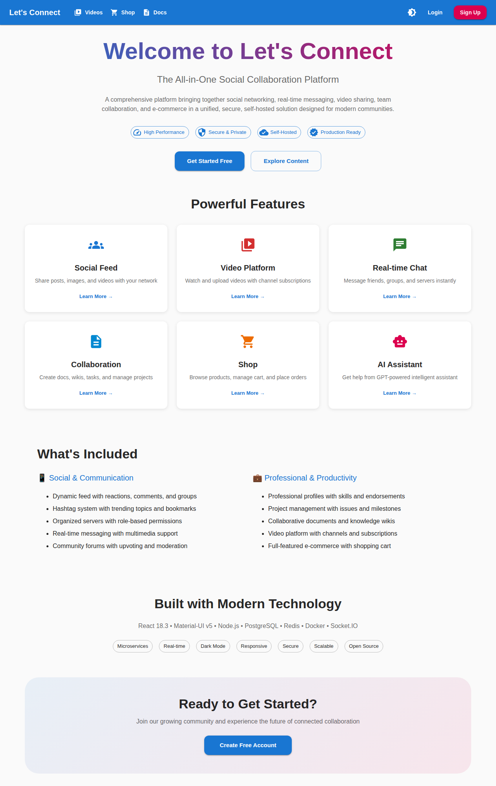
- Landing page with welcome message
- Navigation menu
- Feature highlights
- Call-to-action buttons

### 02. Login Page
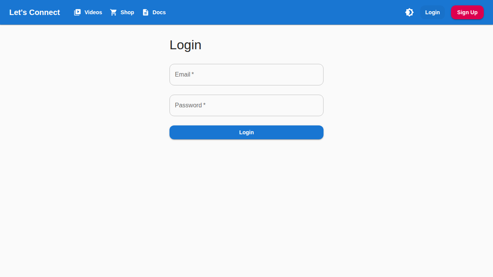
- User authentication form
- Social login options (Google, GitHub)
- Password recovery link
- Clean, modern design

### 03. Register Page
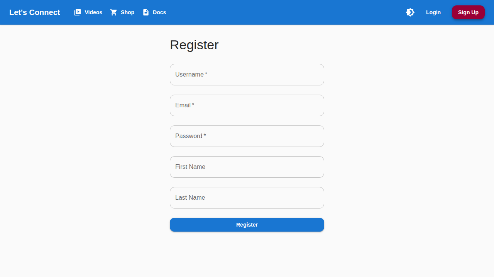
- User registration form
- Email verification
- Terms and conditions
- hCaptcha integration

### 04. Videos Page
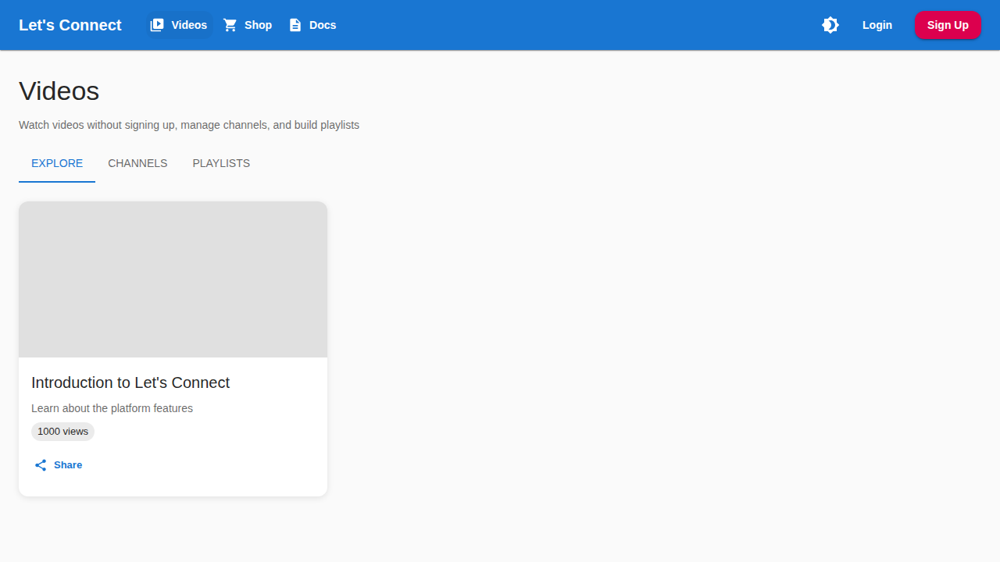
- Video feed and discovery
- Streaming video player
- Video recommendations
- Categories and filters

### 05. Shop Page
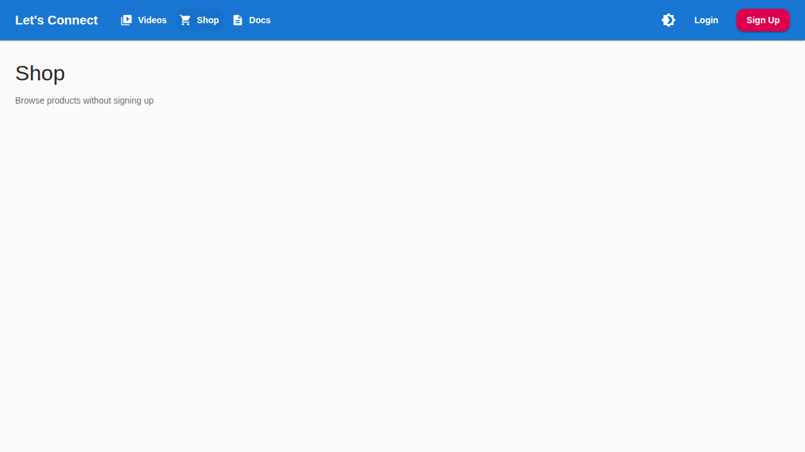
- E-commerce marketplace
- Product listings
- Shopping cart
- Product search and filters

### 06. Docs Page
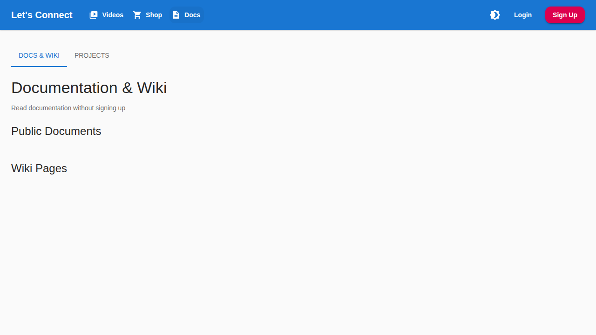
- Documentation hub
- Help center
- FAQ section
- Guides and tutorials

### 07. Feed Page
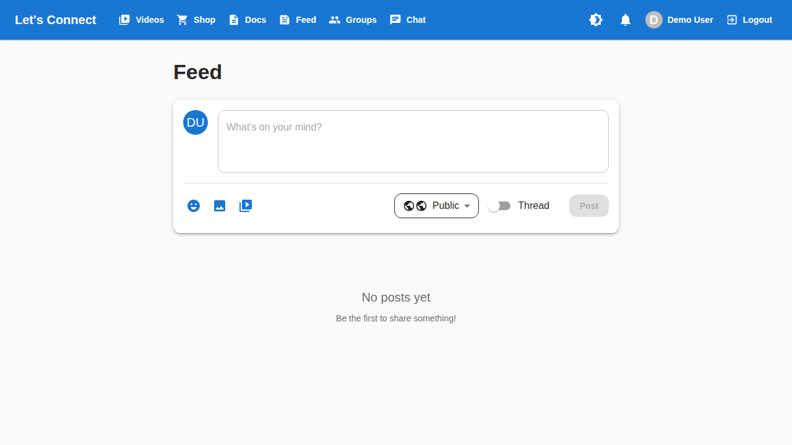
- Social media feed
- Posts from connections
- Reactions and comments
- Post composer

### 08. Groups Page
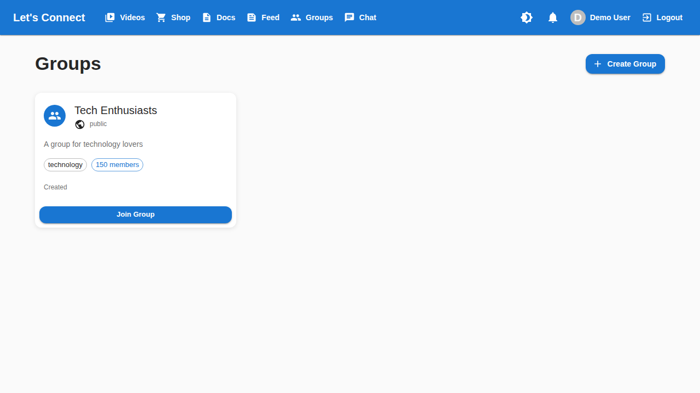
- Community groups
- Group discovery
- Member management
- Group posts and discussions

### 09. Bookmarks Page
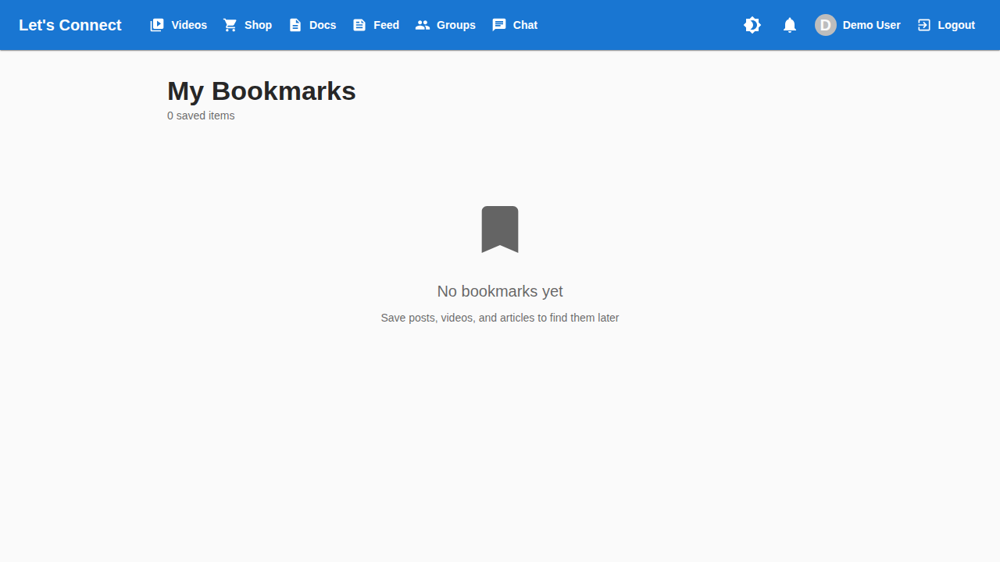
- Saved posts and content
- Collections organization
- Quick access to favorites
- Filter and search

### 10. Chat Page
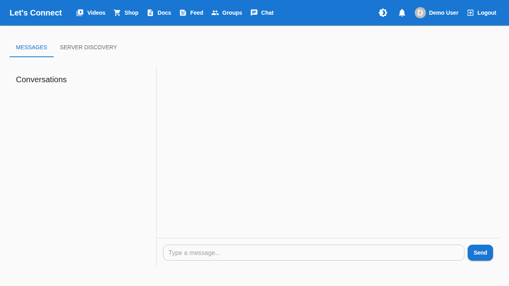
- Real-time messaging
- Conversations list
- Message history
- File sharing

### 11. Profile Page
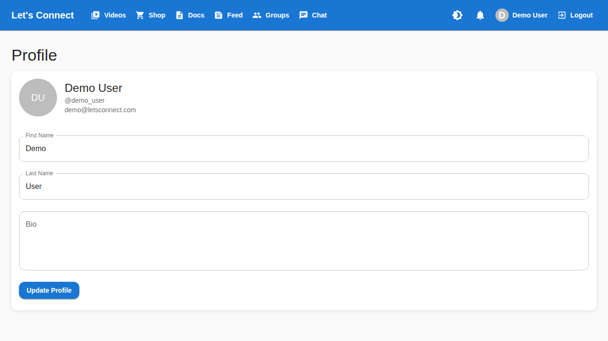
- User profile
- Activity timeline
- Profile settings
- Privacy controls

### 12. Home Page (Dark Mode)
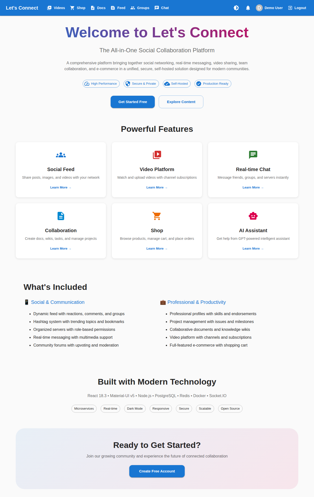
- Dark theme variant
- Eye-friendly design
- Consistent UI elements
- Theme toggle

## Key Features Demonstrated

### Social Features
- ✅ Posts and feeds
- ✅ Comments and reactions
- ✅ Groups and communities
- ✅ Friend connections
- ✅ Bookmarks and saves

### Communication
- ✅ Real-time chat
- ✅ Group messaging
- ✅ Video calls (see collaboration features)
- ✅ Notifications

### Content
- ✅ Video streaming
- ✅ Media uploads
- ✅ Content discovery
- ✅ Search functionality

### E-commerce
- ✅ Product marketplace
- ✅ Shopping cart
- ✅ Product listings
- ✅ Search and filters

### User Experience
- ✅ Responsive design
- ✅ Dark/Light themes
- ✅ Intuitive navigation
- ✅ Modern UI components

### Security
- ✅ OAuth integration
- ✅ Two-factor authentication
- ✅ CAPTCHA protection
- ✅ Secure authentication

## UI/UX Highlights

### Design System
- **Framework**: Material-UI (MUI)
- **Theme**: Customizable light/dark modes
- **Icons**: Material Icons
- **Typography**: Clean, readable fonts
- **Colors**: Professional color palette

### Responsive Design
All pages are fully responsive and work on:
- 📱 Mobile devices
- 📱 Tablets
- 💻 Desktops
- 🖥️ Large screens

### Accessibility
- Screen reader support
- Keyboard navigation
- High contrast mode
- ARIA labels

## Additional Screenshots

### Audit Reports (February 2026)
See `audit-feb-2026/` directory for:
- Security audit screenshots
- Performance reports
- Feature verification
- Compliance checks

## Taking New Screenshots

To capture updated screenshots:

1. **Start the application**
   ```bash
   docker-compose up
   ```

2. **Access the frontend**
   - URL: http://localhost:3000
   - Login with test credentials
   - Navigate to different pages

3. **Capture screenshots**
   - Use browser screenshot tools
   - Or use tools like:
     - Windows: Snipping Tool, Print Screen
     - Mac: Command+Shift+4
     - Linux: Screenshot tool, Flameshot

4. **Save screenshots**
   - Name format: `##-page-name.png`
   - Resolution: 1920x1080 recommended
   - Format: PNG for quality

5. **Update this README**
   - Add new screenshot descriptions
   - Include feature highlights
   - Note any UI changes

## Screenshot Guidelines

When taking screenshots:
- ✅ Use test/dummy data (no real user information)
- ✅ Show key features clearly
- ✅ Use consistent browser window size
- ✅ Include both light and dark themes
- ✅ Capture error states and edge cases
- ✅ Show mobile responsive views
- ⚠️ Remove any sensitive information
- ⚠️ Avoid real email addresses or names
- ⚠️ Don't include personal data

## Using Screenshots

These screenshots can be used for:
- Documentation
- Presentations
- Marketing materials
- Bug reports
- Feature demonstrations
- Training materials

## Questions?

For more information about the application:
- See `README.md` in the root directory
- Check `QUICK_START.md` for setup
- Review `docs/` for detailed documentation

---

**Last Updated:** February 2026
**Screenshot Count:** 12 main screenshots
**Themes:** Light and Dark modes
**Resolution:** Various (primarily 1920x1080)
